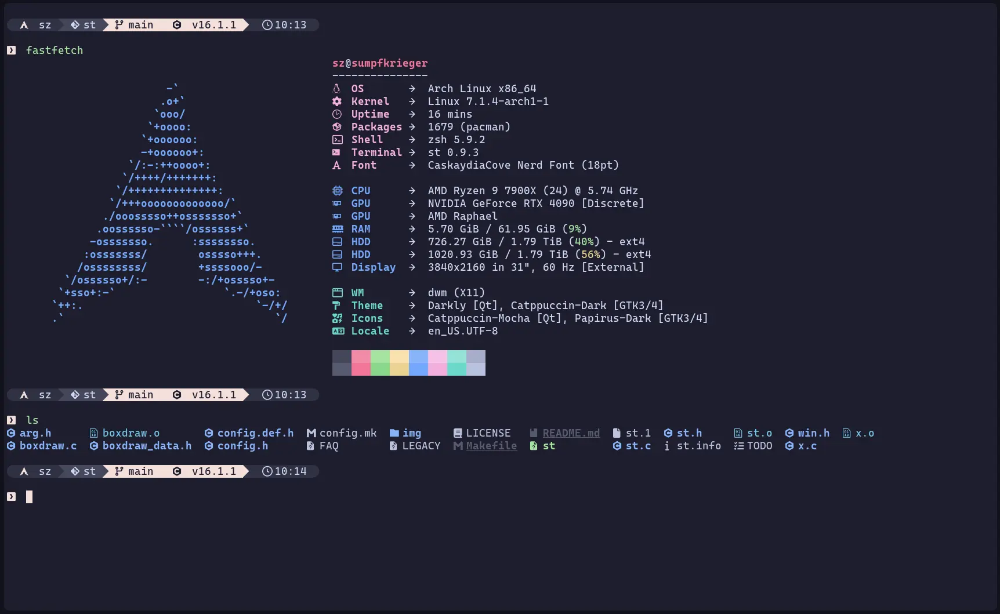

# My build of st - a simple terminal

This is my custom build of [st](https://st.suckless.org/), a simple terminal
originally from the official [suckless](https://suckless.org/) website,
customized to suit my personal needs and provide a minimal terminal with all
necessary functionality.



## Applied Patches

I have applied the following patches to enhance functionality and appearance:

- [`alpha`](https://st.suckless.org/patches/alpha/)
- [`boxdraw`](https://st.suckless.org/patches/boxdraw/)
- [`blinking_cursor`](https://st.suckless.org/patches/blinking_cursor/)
- [`expected-anysize`](https://st.suckless.org/patches/anysize/)
- [`glyph_wide_support`](https://st.suckless.org/patches/glyph_wide_support/)
- [`glyph_wide_support_redraw_fix`](https://github.com/LukeSmithxyz/st/pull/349)
- [`scrollback_mouse`](https://st.suckless.org/patches/scrollback/)
- [`scrollback_ringbuffer`](https://st.suckless.org/patches/scrollback/)
- [`swapmouse`](https://st.suckless.org/patches/swapmouse/)

## Patch Functionality

These patches enhance the usability and appearance of **st** by adding support
for transparency, a blinking cursor, wide glyphs (including emojis and Nerd
Fonts), and improved rendering of box drawing characters and block glyphs. They
also enable smooth mouse-based scrollback, a ring buffer for terminal history,
and allow resizing the terminal to any dimensions. Together, they provide a more
complete and modern terminal experience while keeping **st** lightweight and
minimal.

The `swapmouse` patch changes the mouse cursor to the global default when a
running program enables mouse mode (e.g. `nvim`, `ranger`, `fzf`).

The wide glyph patch (used for correct rendering of Nerd Font icons, emojis, and
CJK characters) does not fully solve truncation in every case — see
[LukeSmithxyz/st#349](https://github.com/LukeSmithxyz/st/pull/349) for a
detailed explanation of what it fixes and what it doesn't. In this build, an
additional clip-region fix was applied on top to resolve truncated icons in
Neovim.

## Additional Customizations

- Installed **CaskaydiaCove Nerd Font** at 18px size
- Included the [Starship](https://starship.rs/) cross-shell prompt
- Changed colors to [Catppuccin Mocha](https://github.com/catppuccin/catppuccin)
  colorscheme using this [style
  guide](https://github.com/catppuccin/catppuccin/blob/main/docs/style-guide.md)
- Alpha patch is applied but transparency is disabled by default (`alpha =
1.0`); set a lower value in `config.h` and run a composite manager (e.g.
  `xcompmgr`, `picom`) to enable it
- Added 5px border padding around the terminal window
- Fixed a clip-region issue that truncated wide Nerd Font glyphs (see commit history)

## Key Bindings

This build of **st** uses the default key bindings, enhanced with:

- `Shift + Enter`: Sends a newline character (to support multi-line input in TUI
  applications like [Pi](https://github.com/earendil-works/pi))

Mouse wheel scrolling without Shift is intentionally disabled in `config.def.h`,
since it's handled by my `dwm` setup instead.

Clipboard-related shortcuts like `Alt + C` and `Alt + V` are configured in my
`dwm` setup and call `cliphist` via `dmenu`.
You can find the clipboard history script here: [cliphist](https://github.com/sebastianzehner/cliphist)

## Requirements

In order to build st you need the Xlib header files.

## Installation

Edit `config.mk` to match your local setup (st is installed into the
`/usr/local` namespace by default).

```bash
git clone https://github.com/sebastianzehner/st
cd st
make clean install
```

## Running st

If you did not install st with `make clean install`, you must compile the st
terminfo entry with the following command:

```bash
tic -sx st.info
```

See the man page for additional details.

## Credits

Based on Aurélien APTEL `<aurelien dot aptel at gmail dot com>` bt source code.

## Disclaimer

I'm not a professional developer - just a hobbyist sharing my personal setup.
This build is provided as-is, with no guarantees that it will work for you.
If something breaks, you're on your own — but feel free to explore, adapt, and improve!
